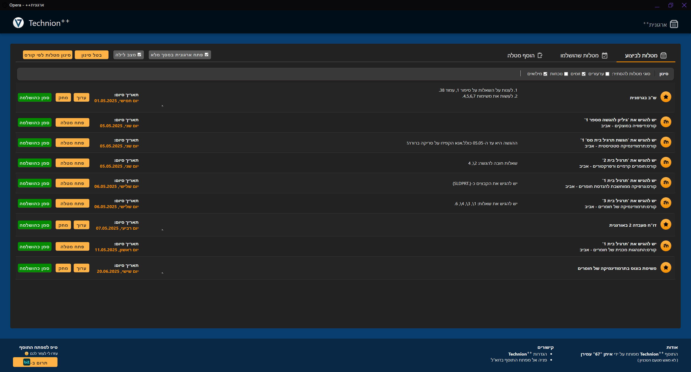
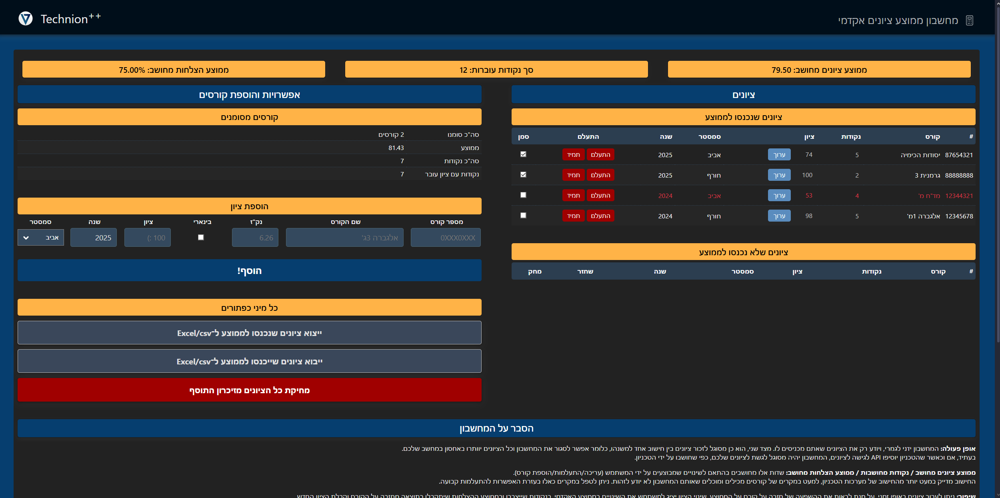
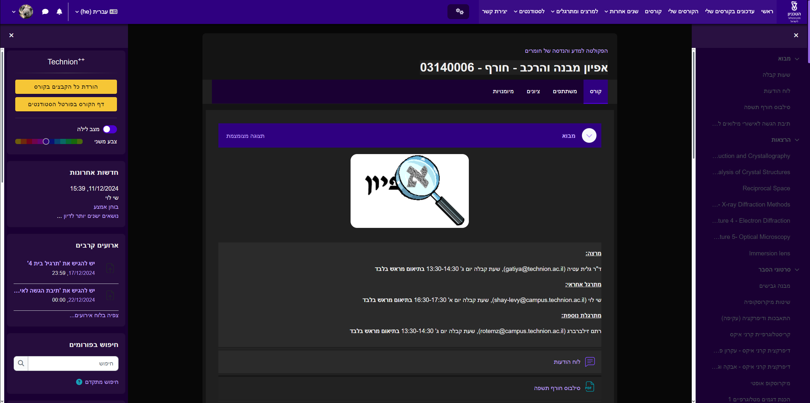
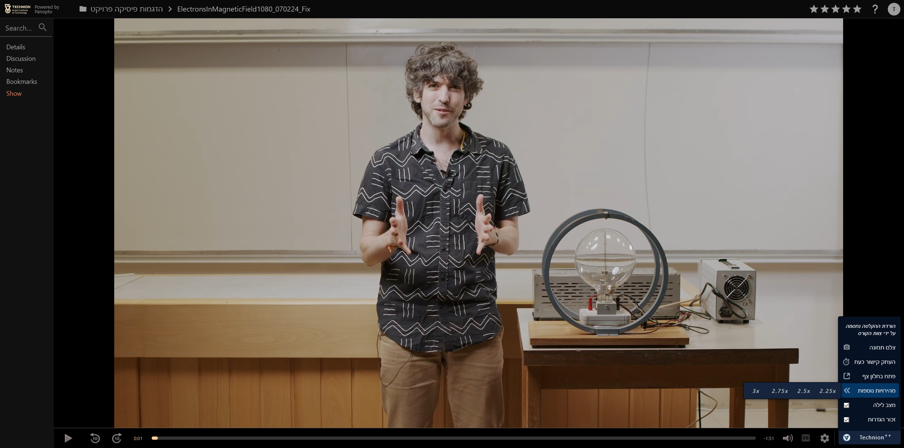

#  Technion++

## _Get the Technion's web-experience out of the stone age._

  

## תוכן עניינים

- [תיאור כללי וקישורים להוריד](#תיאור-כללי-וקישורים-להוריד)
- [פ'יצרים – מה התוסף עושה?](#פיצרים--מה-התוסף-עושה)
    - [התחברות אוטומטית למערכות הטכניון](#התחברות-אוטומטית-למערכות-הטכניון)
    - [הצגת מטלות קרובות](#הצגת-מטלות-קרובות)
    - [ארגונית ++](#ארגונית-)
    - [מחשבון ממוצע ציונים אקדמי](#מחשבון-ממוצע-ציונים-אקדמי)
    - [שיפורים במערכת המודל](#שיפורים-במערכת-המודל)
    - [שיפורים באתרי הפקולטה למדמ"ח](#שיפורים-באתרי-הפקולטה-למדמח-grwebcourse)
    - [שיפורים במערכת פנופטו](#שיפורים-במערכת-פנופטו)
    - [חיפוש וידאו מהיר](#חיפוש-וידאו-מהיר)
    - [שליחת קבצים להדפסה](#שליחת-קבצים-להדפסה)
    - [מסעדות פתוחות בטכניון](#מסעדות-פתוחות-בטכניון)
    - [מנהל הורדות](#מנהל-הורדות)
    - [שונות](#שונות)
- [תנאי שימוש ומדיניות פרטיות](#תנאי-שימוש-ומדיניות-פרטיות)
    - [אמ;לק](#אמלק)
    - [איזה מידע נאסף על ידי התוסף?](#איזה-מידע-נאסף-על-ידי-התוסף)
    - [איסוף המידע](#איסוף-המידע)
    - [שימוש במידע](#שימוש-במידע)
    - [שמירת המידע](#שמירת-המידע)
    - [פרטיות המידע](#פרטיות-המידע)
    - [קישורים חיצוניים](#קישורים-חיצוניים)
    - [אבטחת מידע](#אבטחת-מידע)
    - [שינויים במדיניות הפרטיות](#שינויים-במדיניות-הפרטיות)
    - [מילות סיכום](#מילות-סיכום)
- [אודות וצור קשר](#אודות-וצור-קשר)
    - [מפתח(ים)](#מפתחים)
    - [מאגר הקוד](#מאגר-הקוד)
    - [יצירת קשר](#יצירת-קשר)
    - [תרומה](#תרומה)

## תיאור כללי וקישורים להוריד

התוסף _Technion Plus Plus_ (ובקצרה _++Technion_ (ובעברית _טכניון++_ ובערבית _التخنيون++_)) הוא תוסף לדפדפנים על בסיס
Chromium (למשל Google Chrome, Opera, Brave, Microsoft Edge, ועוד), ואולי בעתיד גם FireFox, שמטרתו היא לעשות סדר בבלגן,
להוסיף תכונות משודרגות ולהפוך את השימוש במערכות הטכניון השונות לנוח ויעיל יותר.
בין התכונות המשולבות בתוסף: התחברות אוטומטית למרבית מערכות הטכניון, רשימות ToDoList של מטלות בית לכל מערכות הטכניון עם
התראות כשיוצאות מטלות חדשות, חיפוש וידאו ישירות מהתוסף ללא קשר לשרת בו הוא נמצא, הורדת תוכן קורסים מהפנופטו, המודל ואתרי
מדמ"ח בלחיצת כפתור, מחשבון ממוצע אקדמי מדוגם לתפארת ועוד תכונות רבות.
חשוב לציין שהתוסף הינו פרויקט עצמאי, לא חובה פקולטית ולא מוגש מטעם הטכניון. מוגש מטעם איתן "67" עמירן, ומבוסס על
_טכניון+_ של מאור לוי.

ניתן להתקין את התוסף (עבור דפדפנים מבוססי Chromium)
מ[כאן](https://chromewebstore.google.com/detail/technion-plus-plus/pfhjnidbfndnjhpcpfecngcigdjebemk).
קישור הורדה לדפדפנים מבוססי FireFox אולי יהיה זמין בעתיד (כרגע זה מעט בעייתי עקב הצורה בה הדפדפנים השונים מימשו תכונות
שונות).

## פ'יצרים – מה התוסף עושה?

### התחברות אוטומטית למערכות הטכניון

התוסף מאפשר התחברות אוטומטית לרוב מערכות הטכניון, ובפרט למערכות הבאות: מודל, פנופטו, SAP, אתר הפקולטה למדמ"ח (GR++).
לאחר התקנת התוסף, יש להגדיר את פרטי ההתחברות בהגדרות התוסף, ומכאן ואילך התוסף כבר ידאג לחבר אתכם אוטומטית אל המערכות
הנ"ל. ניתן לבטל בלחיצת כפתור את החיבור האוטומטי במקרה הצורך.

### הצגת מטלות קרובות

- הצגת רשימת מטלות קרובות במערכות המודל, מדמ"ח ווובוורק.
- התוסף מעדכן את המשתמש בעזרת התראה כאשר מגיעות מטלות חדשות, כאשר מטלות אלו יסומנו עד שהמשתמש יצפה בהן.
- עבור כל מטלה תוצג כותרת המטלה, הקורס, קישור להגשת המטלה במודל או לאתר הקורס במערכות GR++ ווובוורק.
- ניתן לסמן מטלות ככאלה שבוצעו והן יועברו לכרטיסיית "מטלות שהושלמו".

### ארגונית++ ✨

- הצגת מטלות משולבת ונוחה של 3 המערכות העיקריות – מודל, מדמ"ח ווובוורק.
- סינון מטלות לפי קורס ללא תלות במערכת בה נמצאת המטלה.
- הוספת מטלות ידנית.

### מחשבון ממוצע ציונים אקדמי

- בלחיצה מהתפריט הראשי של התוסף, המחשבון יוצא לפעולה ומסדר את כל הציונים שלכם.
- בפעם הראשונה צריך להזין אותם ידנית, אולם לאחר מכן המחשבון זוכר את הציונים כאילו הם תמיד היו שם.
- המחשבון מחשב ממוצע ציונים, ממוצע הצלחות ונקודות זכות שנצברו.
- ניתן לחשב ממוצע עבור כל תת־קבוצת קורסים בהתאם לרצון המשתמש. באופן אוטומטי, המחשבון מחשב עבור הסמססטר העדכני ביותר.
- בעזרת המחשבון אפשר להתעלם מקורסים, לבדוק שיפור של ציונים בקורסים ולהוסיף ציונים חדשים כדי לבדוק כיצד הם ישנו את ממוצע
  הציונים / ממוצע ההצלחות / הנקודות שנצברו.
- ייצוא ל־CSV של הציונים שנכנסו לממוצע (כאמור, ניתן לבחור איזה קורסים להכניס לממוצע במחשבון).
- ייבוא מ־CSV ציונים שיכנסו לממוצע (ואחר כך ניתן לבחור אלו להשאיר בממוצע ואלו להוציא ממנו).
- מחיקת כל הציונים מהמחשבון בלחיצת כפתור, כך שאפשר להתחיל מחדש עם ציונים חדשים.

### שיפורים במערכת המודל

- מצב "לילה" – עיצוב כהה למודל. ניתן להפעיל ולבטל את העיצוב בלחיצת כפתור. ניתן לבחור צבע משני מבין 12 גוונים.
- כפתור "הורדת קבצי כל הקורסים של סמסטר זה" בדף הראשי של המודל. הקבצים ירדו אחד אחרי השני בתור, ניתן לצאת מהדף או להמשיך
  לגלוש באתרים אחרים ללא הפרעה.
- בעת כניסה לדף הראשי של המודל, תחת רשימת הקורסים לפי סמסטר, תיפתח מיידית רשימת הסמסטר הרלוונטי. בזמן סמסטר קיץ, תיפתח
  גם הרשימה של סמסטר אביב.
- ברשימת הקורסים במודל שבבלוק של "ניווט" נוספו שמות קורסים לצד המספרים, כדי להקל על מעבר בין אתר של קורס אחד לאתר של
  קורס אחר.
- כפתור "הורדת חומר הקורס" בדף הראשי של המודל לכל קורס.
- כפתור "הורדת יחידת לימוד" לצד כל כותרת של יחידת לימוד במודל.

### שיפורים באתרי הפקולטה למדמ"ח (GR++/Webcourse)

- כפתור להורדת כל הקבצים (תיקיות שלמות) תחת "חומר הקורס" באתרי הפקולטה. יעיל במיוחד כשרוצים להוריד את כל המבחנים,
  ההרצאות והתרגולים בבת אחת. הקבצים ירדו אחד אחרי השני בתור, ניתן לצאת מהדף או להמשיך לגלוש באתרים אחרים ללא הפרעה.
- קיימת אפשרות להוריד כל כותרת תחת "חומר הקורס" (למשל, כל תרגול או מועד במבחן) לתת-תיקיה נפרדת.
- ניתן להוריד את כל הקבצים לפי סוגי קבצים ספציפיים: PDF, ZIP, Word, PowerPoint. קבצים עם סיומות שלא הוזכרו, עדיין ירדו
  כחלק מלחיצה על כפתור "הורדת כל הקבצים".
- לאחר התקנת התוסף פתיחת מצגות PDF באתרי הפקולטה תהיה תמיד לכרטיסייה חדשה, במקום שהמצגות ייטענו תמיד לאותה כרטיסייה.
- שמות הקורסים יופיעו בנוסף למספרי הקורסים בכרטיסיות המתאימים של אתרי הקורסים.

### שיפורים במערכת פנופטו

- הורדת וידאו מהפנופטו – סרטונים יחידים, רשימת סרטונים בקורס או קורס שלם בלחיצת כפתור מהדף של הקורס. בבחירת קורס שלם או
  רשימת סרטונים, הסרטונים ירדו אחד אחרי השני בתור, ניתן לצאת מהדף או להמשיך לגלוש באתרים אחרים ללא הפרעה.
- מצב "לילה" – בעת צפיה בווידאו ניתן להעביר את הפנופטו למצב "לילה" בלחיצת כפתור, צבעי האתר יוחלפו בצבעים כהים.
- קישורים להרצאות שכבר נצפו יהיו בצבע אדום, כך שיהיה קל יותר לזהות תכנים שכבר נצפו.
- פיצול חלון – עבור וידאו עם מצגת, נוסף כפתור שפותח את הוידאו בחלון נוסף ובכך מאפשר לצופה לצפות במרצה בתצוגה גדולה יותר.
  בנוסף, השימוש בחלון נוסף מאפשר לצופה להשתמש במסך מלא עבור שני החלונות בנפרד – שימושי למי שמחזיק בשני מסכים!
- אפשרות "חלון צף", ככה שאפשר לראות את ההרצאה ולהמשיך לגלוש או לעשות כל דבר אחר עם המחשב.
- אפשרות לצילום תמונה מיידי במהלך צפיה. אם נמצאים בהקלטה שמחולקת להרצאה ומצגת, התוסף ישאל איזה חלק מהשניים לצלם.
- הוספת מהירויות צפיה מעבר לפי 2, עד מהירות פי 3.
- שמירת העדפות – התוסף יזכור את בחירת מצב "לילה" והמהירות ויפעיל אותן אוטומטית בפעם הבאה שתפעילו וידאו בפנופטו. למשל:
  לאחר שינוי למצב מוחשך + מהירות 1.5x, כל הסרטונים שתפעילו להבא בפנופטו יפעלו גם הם אוטומטית בתצורה זו. התוסף יזכור גם
  לחיצה על כפתור Show/Hide בצפיית וידאו עם מצגות.
- כפתור להעתקת קישור לסרטון בזמן ספציפי. ניתן להעתיק רק את הקישור או קישור מעוצב בפורמט MarkDown.

### חיפוש וידאו מהיר

- חיפוש מהיר של וידאו לקורסים ישירות מתוך התוסף, ללא קשר לשרת בו הווידאו נמצא (פנופטו / שרת הווידאו הישן).
- אם יש יותר מקורס אחד שמתאים לקריטריון החיפוש - תינתן רשימה של כל הקורסים המתאימים.
- אם לקורס יש יותר מהקלטת וידאו אחת, תינתן אפשרות לבחור בין ההקלטות השונות.
- לצד כל קישור של הקלטה יוצג סמל השרת בו נמצאת ההקלטה. במידת האפשר, יוצגו גם שם המרצה וסוג ההקלטה (הרצאה/תרגול).
- רשימת שבעת הקורסים האחרונים שהיו בשימוש דרך החיפוש.

### שליחת קבצים להדפסה

קישורים לשליחת קבצים להדפסה במדפסות הטכניון ייפתח מיידית בג'ימייל או בתוכנה חיצונית לפי העדפת המשתמש (שינוי העדפה יבוצע
בהגדרות התוסף). במידה והכנסתם מספר זהות בהגדרות התוסף, המספר יתווסף אוטומטית לכותרת המייל.

### מסעדות פתוחות בטכניון

התוסף מחזיק רשימה של (רוב) המסעדות בחיפה ובנשר, עם כל המידע עליהן על פי גוגל מפות, והן מסודרות לפי מרחק מהטכניון ומוצגות
על פי שעות פתיחה.

כעת הפ'יצר הזה מאוד שבור; עמכם הסליחה.

### מנהל הורדות

צפייה ברשימת הקבצים הממתינים להורדה על ידי התוסף (לאחר שימוש בפונקציית ההורדה של התוסף במערכות הפנופטו/GR++/Moodle)
ושינוי הרשימה.

### שונות

- חלונית "קישורים שימושיים" בתוסף: אפגרייד, BookMe, לוח שנה אקדמי, מפה רשמית של הטכניון, הורדת אופיס 365 טכניוני
  בחינם, חנות מיקרוסופט של הטכניון ועוד...
- בחירת עוצמת ההתראות (ווליום) עבור מטלות הבית והתראות אוטובוסים.
- כשנכנסים לאתר של שרת הווידאו הישן – בראש העמוד יופיעו קישורי ניווט בהתאם לפקולטה הרצויה. למרות זאת, מומלץ בהרבה להשתמש
  בפונקציית חיפוש הווידאו של התוסף.

## תנאי שימוש ומדיניות פרטיות

### אמ;לק

התוסף טכניון++ פותח במקור על ידי מאור לוי ומפותח בהווה על ידי איתן "67" עמירן על מנת לשמש כל סטודנט בטכניון שרוצה להשתמש
בו. התוסף מיועד לשימוש בחינם, כמו שהוא וללא שינוי.
המשתמש רשאי לעשות כרצונו בהתאם למגבלות רישיון GPLv3. השימוש בתוסף "כרגיל" (הורדתו דרך חנות התוספים הרשמית ושימוש שגרתי
בו) מהווה אישור לכך שהמשתמש קרא את מדיניות הפרטיות המפורטת בדף זה והסכים לה.

התוסף, טכניון++, אוסף **רק** את הפרטים הבאים שהמשתמש מזין לו מרצונו החופשי: **העדפות כלליות, אימייל טכניוני, סיסמה
לאימייל הטכניוני, מספר תעודת זהות, סיסמת יומן GR++, קישור מותאם אישית**. אם המידע נמחק מהתוסף (על ידי דף ההגדרות)
הוא נמחק כליל ולא נשמר בשום מקום. פרטי המשתמש וההגדרות שבשימוש התוסף נשמרים בזיכרון הדפדפן של המשתמש בלבד ולא נשלחים
לאף שרת (למעט שרתים רשמיים של הטכניון) וכמובן שלא לאף צד ג'. יש להבהיר שוב כי התוסף לא שולח שום מידע לשום מקום;
**כל המידע נותר לוקאלית על המחשב של המשתמש**.

### איזה מידע נאסף על ידי התוסף?

- מידע אישי (לדוגמה: שם משתמש טכניוני, מספר זהות, רשימת המטלות ממערכות הטכניון וכו'). מידע אישי בדרך כלל ייאסף רק לאחר
  מסירתו על ידי המשתמש או לאחר דרישה של המשתמש שהתוסף יאסוף אותו עבורו. **אין חובה למסור מידע אישי, אך פעילות התוסף
  לעיתים תהיה תלויה בכך**, כגון עבור חיבור אוטומטי למערכות הטכניון והצגת מטלות בית.
- מידע שאינו מהווה מידע אישי, למשל שאר ההגדרות וההעדפות, וכו'.
- יש לציין כי חנות התוספים ממנה הורד התוסף יכולה לאסוף מידע הנוגע למשתמשי התוסף, וזאת בהתאם למדיניות הפרטיות שלה: מערכת
  ההפעלה, שפת שימוש, סטטיסטיקות למיניהן ועוד. מידע זה לא נאסף על ידי התוסף עצמו, ואין למפתח התוסף כל שליטה או אחריות על
  המידע שנאסף על ידי חנויות התוספים או דרך למנוע את אסיפתו.

### איסוף המידע

- המידע נאסף בחלקו **באופן יזום** על ידי המשתמש דרך דף ההגדרות של התוסף, או לאחר לחיצה של המשתמש על אחד מכפתורי התוסף
  השונים – אלו שבחלוניות התוסף ואלו אותם התוסף מציג באתרי הטכניון השונים.
- התוסף אוסף מידע גם **באופן אוטומטי** ולא רק באופן יזום על ידי המשתמש, למשל בעת איסוף מידע הקשור להצגת מטלות בית.

### שימוש במידע

בפרטים ובמידע האישי שתמסור ובפרטים שיאסוף התוסף במהלך השימוש שתעשה בו, ייעשה שימוש בהתאם להוראות מדיניות זו או על פי
הוראות כל דין, וכל זאת בכדי לאפשר לך להשתמש בצורה מלאה בתוסף, בתכנים הכלולים בו ובשירותים שהוא מציע – למשל: חיבור
אוטומטי למערכות הטכניון, הצגת מטלות בית וכו'.
**לא יעשה במידע שימוש על מנת לעקוב אחרי המשתמש** או להרוויח כסף בצורה זו או אחרת.

### שמירת המידע

- המידע האישי שהתוסף אוסף נשמר אך ורק בזיכרון המחשב הפרטי של המשתמש, תחת זיכרון הדפדפן בו מותקן התוסף.
- בפרט, מפתח התוסף אינו מחזיק בשום מאגר מידע בו הוא מחזיק במידע אישי של משתמשי התוסף.
- **מחיקת התוסף מהדפדפן תהווה מחיקה מלאה של כל המידע האישי של המשתמש שקיים בידי התוסף ומפתחו.**

### פרטיות המידע

- המידע האישי שנאסף על ידי התוסף **לא מועבר לאף גורם בשום מקרה**, למעט פרטי החיבור של המשתמש (משתמש טכניוני וסיסמת
  המשתמש, או מספר זהות וסיסמת יומן GR++) המועברים למערכות הטכניון לשם חיבור המשתמש למערכות הטכניוניות או באיסוף מידע לשם
  הצגת מטלות בית.
- כאשר המידע הנ"ל מועבר למערכות הטכניון, שליחת המידע מתבצעת דרך פרוטוקול HTTPS המאובטח.

### קישורים חיצוניים

בתוסף קיימים קישורים לאתרים חיצוניים - מערכות הטכניון, חנויות תוכנות, ג'ימייל ועוד. לאחר לחיצה על אחד מהקישורים האלו,
המשתמש יועבר לאתר חיצוני בו לא חלה שום אחריות מכל סוג שהוא על מפתח התוסף. לכל אחד מהאתרים החיצוניים הנ"ל ייתכן שיהיו
מדיניות פרטיות ותנאי שימוש להם יהיה כפוף המשתמש בעת השימוש בהם.

### אבטחת מידע

- המידע האישי של המשתמש נשמר על מחשב המשתמש בלבד כפי שהובהר, ומועבר למערכות הטכניוניות אך ורק על ידי שימוש בפרוטוקול
  המאובטח HTTPS, וכל זאת על מנת למזער ככל הניתן כל סיכון לפגיעה בפרטיות המשתמש. עם זאת, לא ניתן להבטיח חסינות מוחלטת
  מפני חשיפת מידע או גניבתו.
- **חלה כמובן חובה גם על המשתמש להגן על מחשבו בכל דרך** – למשל על ידי שימוש בתוכנות אנטי וירוס, חיבור לרשתות אינטרנט
  מוצפנות וכו', שכן למפתח התוסף אין אפשרות כלל להתגונן מפני פרצות אבטחה כאלו.

### שינויים במדיניות הפרטיות

ככלל, באפשרותו של מפתח התוסף לעדכן מפעם לפעם את מדיניות הפרטיות של התוסף, לכן מומלץ לכל משתמש לבקר בדף זה אחת לזמן מה.
במקרה של שינוי מהותי במדיניות, תועבר הודעה מתאימה למשתמשי התוסף דרך התוסף לאחר עדכון התוסף. **לכן, חלה על המשתמש חובה
לוודא שהוא משתמש בגירסה העדכנית ביותר של התוסף, שכן אין דרך אחרת להבטיח קבלת התראות שכאלו אודות שינויים כנ"ל.**

אם אינך מסכים עם הנוסח המעודכן של המדיניות, עליך לחדול מלעשות שימוש נוסף בתוסף ולמחוק אותו.

### מילות סיכום

אני חושב שכל הדבר הזה מעט מוגזם, אבל סך הכל הכל כאן נכון ואין למשתמש דבר להפסיד משימוש בתוסף, ולכן אין סיבה לא לכתוב את
זה ולא להסכים לזה.

## אודות וצור קשר

### מפתח(ים)

התוסף פותח בעבר בהתנדבות על ידי **מאור לוי** ומפותח בהווה גם בהתנדבות על ידי **איתן "67" עמירן**, ואינו נתמך בשום צורה
על ידי הטכניון.

בנוסף, ברצוני להודות למפתח של האתר המצוין [CheeseFork](https://cheesefork.cf) על שיתוף הפעולה בשיתוף היסטוגרמות.

### מאגר הקוד

כל הקוד של התוסף ממועזר. זה נעשה כדי שהוא ירוץ מהר יותר על המחשב שלכם. אם בכל מקרה מעניין אתכם לראות את הקוד, כדי לוודא
שאני לא מריץ לכם וירוס על המחשב, לא אלאה אתכם בקריאת קוד ממוזער – אתם עכשיו נמצאים במאגר הקוד המלא.

### יצירת קשר

יש לכם עצה? לא הצלחתם לדווח על תקלה או לבקש פי'צר חדש במאגר הקוד? סתם רוצים לדבר?? מוזמנים ליצור קשר עם המפתח
במייל בכתובת [ethan.amiran@gmail.com](mailto:ethan.amiran@gmail.com), או להשתמש בכפתור בכרטיסיית האודות בתוסף על מנת
לשלוח מייל בקלות. אם בכלל הגעתם לעמוד הזה תשלחו מייל, סתם כדי שאדע שההשקעה בו הייתה שווה משהו.

### תרומה

אם משהו השתלט עליכם, יש לכם כמה שקלים ספייר ואתם מסיבה כלשהי רוצים לתרום למפתח, תוכלו לתרום למפתח
המקורי, [מאור](https://www.paypal.me/maorlevy/15ILS), או למפתח הנוכחי, [איתן](src/resources/bit_donation.jpg).

