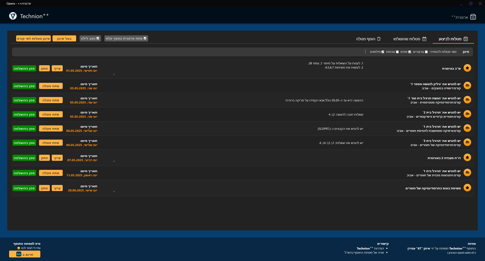
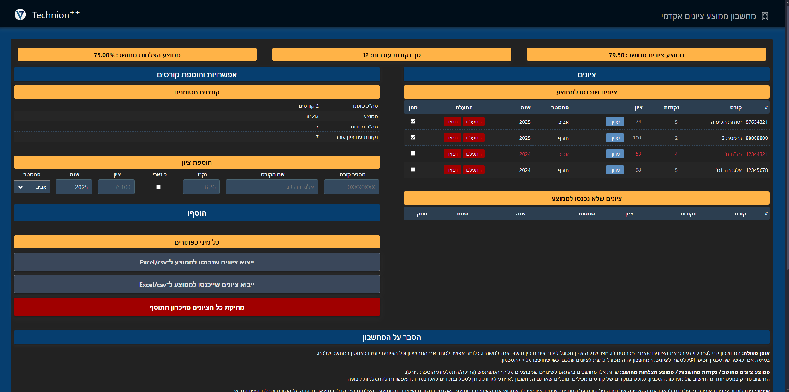
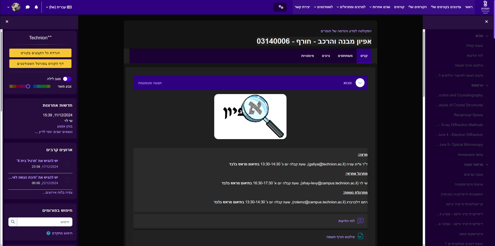
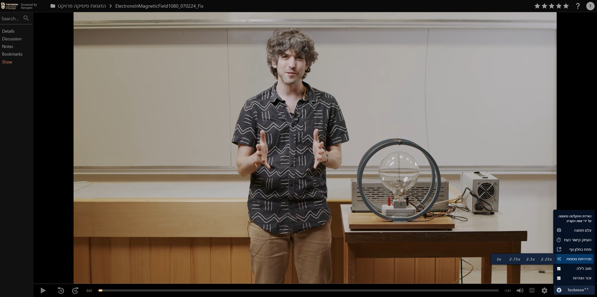

#  Technion++

## _Get the Technion's web-experience out of the stone age._

  

  

## תוכן עניינים

- [תיאור כללי וקישורים להוריד](#תיאור-כללי-וקישורים-להוריד)
- [פ'יצרים – מה התוסף עושה?](#פיצרים--מה-התוסף-עושה)
- [תנאי שימוש ומדיניות פרטיות](#תנאי-שימוש-ומדיניות-פרטיות)
- [אודות וצור קשר](#אודות-וצור-קשר)

## תיאור כללי וקישורים להוריד

התוסף _Technion Plus Plus_ (ובקצרה _++Technion_ (ובעברית _טכניון++_ ובערבית _التخنيون++_)) הוא תוסף לדפדפנים – על בסיס
Chromium (למשל Google Chrome, Vivaldi, Opera, Brave, Microsoft Edge, ועוד)
וגם על בסיס Gecko (למשל FireFox, Pale Moon, SeaMonkey, LibreWolf, Zen, ועוד) – שמטרתו היא לעשות סדר בבלגן, להוסיף תכונות
משודרגות ולהפוך את השימוש במערכות הטכניון השונות לנוח ויעיל יותר.

בין התכונות המשולבות בתוסף: התחברות אוטומטית למרבית מערכות הטכניון, _ארגונית++_ לניהול יעיל של מטלות ושיעורי בית בכל
מערכות הטכניון עם התראות כשיוצאות מטלות חדשות, שיפורים רבים ומשמעותיים בפנופטו, חיפוש הקלטות הרצאות ותרגולים ישירות
מהתוסף, הורדת תוכן מאתרי הקורסים, מחשבון ממוצע אקדמי מדוגם לתפארת ועוד תכונות רבות. חשוב לציין שהתוסף הינו פרויקט עצמאי,
לא חובה פקולטית ולא מוגש מטעם הטכניון. מוגש מטעם איתן "67" עמירן, ומבוסס על _טכניון+_ של מאור לוי.

ניתן להתקין את התוסף עבור דפדפנים מבוססי Chromium
מ[כאן](https://chromewebstore.google.com/detail/technion-plus-plus/pfhjnidbfndnjhpcpfecngcigdjebemk)
ועבור דפדפנים מבוססי Gecko מ[כאן](https://addons.mozilla.org/en-GB/firefox/addon/technion-plus-plus/).

## פ'יצרים – מה התוסף עושה?

### התחברות אוטומטית למערכות הטכניון

התוסף מאפשר התחברות אוטומטית לכמעט כל, אם לא כל, מערכות הטכניון, ובפרט למערכות הבאות: מודל, פנופטו, SAP, אתרי הפקולטה
למדמ"ח (GR++/Webcourse), אתר הציונים, ואתר הסטודנטים הישן. לאחר התקנת התוסף, יש להגדיר את פרטי ההתחברות בהגדרות התוסף,
ומכאן ואילך התוסף כבר ידאג לחבר אתכם אוטומטית אל המערכות הנ"ל. ניתן לבטל בלחיצת כפתור את החיבור האוטומטי במקרה הצורך.
הדבר חוסך הרבה זמן ומאמץ, במיוחד עקב קוד הגישה הנוסף שנדרש כיום ברוב מערכות הטכניון (2FA). יש לציין כי מפעם לפעם, בייחוד
במערכות ספציפיות כמו הזום הטכניוני, ההתחברות לא תעבוד כראוי. במקרה כזה, אפשר פשוט לכבות את ההתחברות האוטומטית, להיכנס
ידנית למערכת, ואז להפעיל מחדש את ההתחברות האוטומטית.

### הצגת מטלות קרובות

- הצגת רשימת מטלות קרובות עבור כל אחת משלוש המערכות: מודל, האתר של מדמ"ח ו־WebWork.
- עדכון על מטלות חדשות באמצעות התראות ישירות למחשב שלכם. המטלות החדשות יודגשו אוטומטית על ידי התוסף בכניסה הבאה לרשימות.
- עבור כל מטלה תוצג כותרת המטלה, הקורס, תיאור (אם קיים), וקישור להגשת המטלה במודל או לאתר הקורס במערכות מדמ"ח ו־WebWork.
- ניתן לסמן מטלות ככאלה שבוצעו והן יועברו מכרטיסיית "מטלות לביצוע" לכרטיסיית "מטלות שהושלמו".

### ארגונית++ ✨

- הצגת מטלות משולבת ונוחה של 3 המערכות העיקריות: מודל, מדמ"ח ו־WebWork בחלון גדול ונוח.
- מיון המטלות לפי תאריך יעד ולפי סטטוס הגשה (שהמשתמש בחר).
- סינון מטלות לפי קורס ללא תלות במערכת בה נמצאת המטלה.
- סינון מטלות לפי סוג (ערעורים, זומים, נוכחות, או מילואים).
- הוספת ועריכת מטלות אישיות (כמו "להשקות את העציצים!!") עם כותרת, תיאור, ועם או בלי תאריך סיום.
- נעיצת מטלות כדי שיופיעו תמיד בראש הרשימה.
- מצב מסך מלא לצפייה נוחה יותר.

### מחשבון ממוצע ציונים אקדמי

- המחשבון מחשב ממוצע ציונים, ממוצע הצלחות ונקודות זכות שנצברו.
- בפעם הראשונה צריך להזין את הציונים שלכם ידנית, או לייבא אותם מתדפיס ציונים רשמי של הטכניון (PDF), ולאחר מכן המחשבון
  זוכר את הציונים כאילו הם תמיד היו שם.
- ניתן לחשב ממוצע עבור כל תת־קבוצת קורסים בהתאם לרצון המשתמש. ברירת המחדל, כאשר המחשבון נפתח, היא לחשב עבור קורסים
  מהסמסטר האחרון. ניתן גם לסמן את כל הציונים בבת־אחת או להסיר את הסימון מכולם במהירות באמצעות כפתור ייעודי.
- בעזרת המחשבון אפשר להתעלם מקורסים, לבדוק שיפור של ציונים בקורסים ולהוסיף ציונים חדשים כדי לבדוק כיצד הם ישנו את ממוצע
  הציונים / ממוצע ההצלחות / הנקודות שנצברו.
- המחשבון מזהה ולא מאפשר להוסיף קורסים כפולים, למעט במקרה של קורסי ספורט, וגם הם לא יכולים להיות כפולים באותה שנה באותו
  סמסטר.
- ייצוא הציונים שנכנסו לממוצע (כאמור, ניתן לבחור איזה קורסים להכניס לממוצע במחשבון) ל־CSV.
- ייבוא ציונים מ־CSV או מגיליון ציונים רשמי (PDF).
- מחיקת כל הציונים מהמחשבון בלחיצת כפתור, כך שאפשר להתחיל מחדש עם ציונים חדשים.

### שיפורים במערכת המודל

- מצב "לילה" – עיצוב כהה למודל. ניתן להפעיל ולבטל את העיצוב בלחיצת כפתור. ניתן גם לבחור צבע משני מבין 12 גוונים. הצבע
  המשני אף נשאר גם לאחר כיבוי מצב הלילה.
- כפתור "הורדת קבצי כל הקורסים של סמסטר זה" בדף הראשי של המודל, וכפתורי "הורדת חומר הקורס" ו"הורדת יחידת לימוד" באתרי
  הקורסים. הקבצים ירדו אחד אחרי השני בתור, כך שניתן לצאת מהדף או להמשיך לגלוש באתרים אחרים ללא הפרעה.
- פתיחת קבצי PDF אוטומטית בכרטיסייה חדשה בדפדפן, במקום שהקבצים יבקשו לרדת למחשב שלכם בלי סיבה טובה.
- קישורים מהירים לאתר ה־SAP ולהקלטות בפנופטו של כל קורס במודל לו יש הקלטות, ישירות מדף הקורס במודל.

### שיפורים באתרי הפקולטה למדמ"ח (GR++/Webcourse)

- כפתור להורדת כל הקבצים (תיקיות שלמות) תחת "חומר הקורס" באתרי הפקולטה. יעיל במיוחד כשרוצים להוריד את כל המבחנים,
  ההרצאות והתרגולים בבת אחת. הקבצים ירדו אחד אחרי השני בתור, כך שניתן לצאת מהדף או להמשיך לגלוש באתרים אחרים ללא הפרעה.
- קיימת אפשרות להוריד כל כותרת תחת "חומר הקורס" (למשל, כל תרגול או מועד במבחן) לתת-תיקיה נפרדת.
- ניתן להוריד את כל הקבצים לפי סוגי קבצים ספציפיים: PDF, ZIP, Word, PowerPoint. קבצים עם סיומות שלא הוזכרו, עדיין ירדו
  כחלק מלחיצה על כפתור "הורדת כל הקבצים".
- לאחר התקנת התוסף פתיחת מצגות PDF באתרי הפקולטה תהיה תמיד לכרטיסייה חדשה, במקום שהמצגות ייטענו לאותה כרטיסייה.
- שמות הקורסים יופיעו בנוסף למספרי הקורסים בכרטיסיות המתאימות של אתרי הקורסים.

### שיפורים במערכת פנופטו

- הורדת וידאו מהפנופטו – סרטונים יחידים, רשימת סרטונים בקורס או קורס שלם בלחיצת כפתור מהדף של הקורס. בבחירת קורס שלם או
  רשימת סרטונים, הסרטונים ירדו אחד אחרי השני בתור, כך שניתן לצאת מהדף או להמשיך לגלוש באתרים אחרים ללא הפרעה. ניתן גם
  להוריד רק את השמע בהרצאות. יש לציין כי ניתן להוריד רק אם סגל הקורס מאשר את ההורדה, מסיבות אתיות.
- מצב "לילה" – בעת צפיה בווידאו ניתן להעביר את הפנופטו למצב חשוך. צבעי האתר, גם בעמוד הסרטון וגם ביתר פנופטו, יוחלפו
  בצבעים כהים.
- כפתורים נוחים למהירויות צפיה נוספות מעבר לפי 2, עד מהירות פי 3, כולל אפשרות לקבוע מהירות מותאמת אישית, וחלונית שליטת
  מהירויות צפה, לאנשים שרוצים לשנות את המהירות לעיתים קרובות.
- האצת הסרטון באופן זמני למהירות גבוהה בזמן לחיצה על כפתור shift, לסריקת הסרטון במהירות לבחירת חלק מסוים. לאחר שחרור
  הכפתור הסרטון חוזר למהירות הקבועה. בזמן שמקש shift לחוץ, ניתן להשתמש בגלגלת העכבר או בלחצני החצים (למעלה/למטה) כדי
  להאיץ/להאט את המהירות באופן זמני.
- "חזרה בזמן" – אפשרות לחזור אוטומטית עשר שניות אחורה בסרטון לאחר שינוי המהירות למהירות נמוכה יותר.
- פיצול חלון – עבור וידאו עם מצגת, נוסף כפתור שפותח את הוידאו בחלון נוסף ובכך מאפשר לצופה לצפות במרצה בתצוגה גדולה יותר.
  בנוסף, השימוש בחלון נוסף מאפשר לצופה להשתמש במסך מלא עבור שני החלונות בנפרד – שימושי למי שמחזיק בשני מסכים!
- העברת הסרטון למסך מלא באמצעות לחיצה על מקש F במקלדת (כמו ביוטיוב).
- שינוי עוצמת השמע לערכים מעל 100% (עד 200%) – שימושי במיוחד כאשר ההקלטה נעשתה עם מיקרופון חלש או אם המרצה לא אוהב לעמוד
  ליד המיקרופון. בנוסף, ניתן לשנות את עוצמת הקול באמצעות גלילת העכבר או לחיצה על כפתורי החצים (למעלה/למטה). כאשר משנים
  את עוצמת השמע, מופיע אינדיקטור קטן במרכז המסך.
- חלון צף (Picture-in-Picture) – כך שאפשר לראות את ההרצאה ולהמשיך לגלוש או לעשות כל דבר אחר עם המחשב.
- צילום תמונה מיידי במהלך צפיה, אם מתאפשר. אם נמצאים בהקלטה שמחולקת להרצאה ומצגת, התוסף ישאל איזה חלק מהשניים לצלם.
- כפתור להעתקת קישור לסרטון בזמן ספציפי. ניתן להעתיק רק את הקישור, כדי לשלוח לחברים, או קישור מעוצב בפורמט Markdown, כדי
  להדביק בסיכומים שלכם.
- סריקה אוטומטית של המצגת למטה או הסרגל בצד שמאל, אם התוסף מזהה שסגרתם אותם בעבר. אם תפתחו אותם ידנית, אז התוסף יזכור את
  הבחירה שלכם וישאיר אותם פתוחים.
- קישורים להרצאות שכבר נצפו יהיו בצבע אדום, כך שיהיה קל יותר לזהות תכנים שכבר נצפו.
- שמירת העדפות – התוסף יזכור את כל הבחירות שלכם בפנופטו ויפעיל אותן אוטומטית בפעם הבאה שתפעילו וידאו בפנופטו. למשל:
  לאחר שינוי למצב מוחשך + מהירות 1.5x, כל הסרטונים שתפעילו להבא בפנופטו יפעלו גם הם אוטומטית בתצורה זו. התוסף יזכור גם
  לחיצה על כפתור Show/Hide בצפיית וידאו עם מצגות, וכך הלאה.

<small>אנחנו אוהבים את גידי.</small>

### חיפוש וידאו מהיר

- חיפוש מהיר של וידאו לקורסים ישירות מתוך התוסף, ללא קשר לשרת בו הווידאו נמצא (פנופטו / שרת הווידאו הישן).
- אם יש יותר מקורס אחד שמתאים לקריטריון החיפוש - תינתן רשימה של כל הקורסים המתאימים.
- אם לקורס יש יותר מהקלטת וידאו אחת, תינתן אפשרות לבחור בין ההקלטות השונות.
- רשימת שבעת הקורסים האחרונים שחופשו.

### זמני הגעת אוטובוסים

- הצגת זמני הגעה בזמן אמת של אוטובוסים לתחנה נבחרת בטכניון (מתוך כלל התחנות האפשריות)
  בעזרת [curlbus](https://curlbus.app/), פרויקט סופר מגניב שמשתמש בלו"ז הזמנים הרשמי של משרד התחבורה.
- הרשימה מסודרת לפי זמן הגעה הקרוב ביותר, ומציגה את מספר האוטובוס, יעדו, ואת זמן ההגעה המשוער.
- קיימת אפשרות לקבל התראה 5, 10 או 15 דקות לפני הגעת אוטובוס מסוים לתחנה.

### שליחת קבצים להדפסה

קישורים לשליחת מיילים לשליחת קבצים להדפסה במדפסות הטכניון, בהתאם לבחירת ההדפסה (שחור-לבן/צבע וחד־צדדי/דו"צ). הקישורים
נפתחים בג'ימייל, באאוטלוק או בתוכנה חיצונית לפי העדפת המשתמש (שינוי העדפה מבוצע בהגדרות התוסף). במידה והכנסתם מספר זהות
בהגדרות התוסף, המספר יתווסף אוטומטית לכותרת המייל (כפי שהטכניון דורש).

### מסעדות פתוחות בטכניון

התוסף מחזיק רשימה של כל בתי העסק הרשמיים בטכניון – מסעדות, חנויות, מספרה וכולי – ומציג את העסקים הפתוחים בזמן שהחלונית
פתוחה. זמני הפתיחה והסגירה באדיבות המיילים השבועיים של אס"ט.

### מנהל הורדות

צפייה ברשימת הקבצים הממתינים להורדה על ידי התוסף (לאחר שימוש בפונקציית ההורדה של התוסף במערכות הפנופטו / מודל / מדמ"ח)
ושינוי הרשימה.

### שונות

- אפשרות להוסיף קישור מותאם אישית בראש התוסף, מיד ליד הקישורים למודל ול־SAP. אני ממליץ על קישור לדרייב הפקולטי.
- מצב לילה דינמי המתאים עצמו למערכת ההפעלה. כך, אם בוחרים במערכת ההפעלה שתהיה במצב לילה, גם התוסף יעבור למצב לילה, אם
  בוחרים במערכת ההפעלה שתהיה במצב יום, גם התוסף יעבור למצב יום, ואם בוחרים שיהיה במצב אוטומטי, התוסף יעבור למצב לילה או
  יום בהתאם לשעה ביום. הפיצ'ר הזה מתייחס לעמודים של התוסף (הארגונית, המחשבון, ועמוד ההגדרות) ולמודל.
- חלונית "קישורים שימושיים" בתוסף:
  צ'יזפורק, אתר הציונים (Upgrade), פנופטו, זום טכניוני, אתר הזמנת חדרי לימוד (BookMe), אתר ספריות הטכניון, אתר הסטונדטים
  הישן, לוח שנה אקדמי, מפה רשמית של הטכניון, ספר טלפונים טכניוני, האתר של מרכז הספורט, האתר של אס"ט, קישור להורדת אופיס
  365 טכניוני בחינם, חנות מיקרוסופט של הטכניון ועוד...
- בחירת עוצמת ההתראות (ווליום) עבור מטלות הבית והתראות אוטובוסים.
- ניתן לראות (בעמודים מסוימים של) SAP את היסטוגרמות הקורסים השונים, בעזרת שיתוף פעולה עם האתר
  [CheeseFork](https://cheesefork.cf).

## תנאי שימוש ומדיניות פרטיות

### אמ;לק

התוסף מיועד לשימוש בחינם, כמו שהוא וללא שינוי. המשתמש רשאי לעשות כרצונו בהתאם למגבלות רישיון GPLv3. השימוש בתוסף
"כרגיל" (הורדתו דרך חנות התוספים הרשמית ושימוש שגרתי בו) מהווה אישור לכך שהמשתמש קרא את מדיניות הפרטיות המפורטת בדף זה
והסכים לה.

התוסף, טכניון++, אוסף **רק** את הפרטים הבאים שהמשתמש מזין לו מרצונו החופשי: **העדפות כלליות, אימייל טכניוני, סיסמה
לאימייל הטכניוני, מספר תעודת זהות, סיסמת יומן GR++, קישור מותאם אישית, נתוני משימות לימודיות**. אם המידע נמחק מהתוסף הוא
נמחק כליל ולא נשמר בשום מקום. פרטי המשתמש וההגדרות שבשימוש התוסף נשמרים בזיכרון הדפדפן של המשתמש בלבד ולא נשלחים לאף שרת
(למעט שרתים רשמיים של הטכניון) וכמובן שלא לאף צד ג', אלא אם המשתמש ביצע ביודעין פעולה שהובילה לכך (לדוגמה, שימוש בשירות
האוטובוסים או בצ'יזפורק). יש להבהיר שוב כי התוסף לא שולח שום מידע לשום מקום; **כל המידע נותר לוקאלית על המחשב של
המשתמש**.

### איזה מידע נאסף על ידי התוסף?

- מידע אישי (לדוגמה: שם משתמש טכניוני, מספר זהות, רשימת המטלות ממערכות הטכניון וכו'). מידע אישי בדרך כלל ייאסף רק לאחר
  מסירתו על ידי המשתמש או לאחר דרישה של המשתמש שהתוסף יאסוף אותו עבורו. **אין חובה למסור מידע אישי, אך פעילות התוסף
  לעיתים תהיה תלויה בכך**, כגון עבור חיבור אוטומטי למערכות הטכניון והצגת מטלות בית.
- מידע שאינו מהווה מידע אישי, למשל שאר ההגדרות וההעדפות, וכו'.
- יש לציין כי חנות התוספים ממנה הורד התוסף יכולה לאסוף מידע הנוגע למשתמשי התוסף, וזאת בהתאם למדיניות הפרטיות שלה: מערכת
  ההפעלה, שפת שימוש, סטטיסטיקות למיניהן ועוד. מידע זה לא נאסף על ידי התוסף עצמו, ואין למפתח התוסף כל שליטה או אחריות על
  המידע שנאסף על ידי חנויות התוספים או דרך למנוע את אסיפתו.

### איסוף המידע

- המידע נאסף בחלקו **באופן יזום** על ידי המשתמש דרך דף ההגדרות של התוסף, או לאחר לחיצה של המשתמש על אחד מכפתורי התוסף
  השונים – אלו שבחלוניות התוסף ואלו אותם התוסף מציג באתרי הטכניון השונים.
- התוסף אוסף מידע גם **באופן אוטומטי** ולא רק באופן יזום על ידי המשתמש, למשל בעת איסוף מידע הקשור להצגת מטלות בית.

### שימוש במידע

בפרטים ובמידע האישי שתמסור ובפרטים שיאסוף התוסף במהלך השימוש שתעשה בו, ייעשה שימוש בהתאם להוראות מדיניות זו או על פי
הוראות כל דין, וכל זאת בכדי לאפשר לך להשתמש בצורה מלאה בתוסף, בתכנים הכלולים בו ובשירותים שהוא מציע – למשל: חיבור
אוטומטי למערכות הטכניון, הצגת מטלות בית וכו'. **לא יעשה במידע שימוש על מנת לעקוב אחרי המשתמש** או להרוויח כסף בצורה זו
או אחרת.

### שמירת המידע

- המידע האישי שהתוסף אוסף נשמר אך ורק בזיכרון המחשב הפרטי של המשתמש, תחת זיכרון הדפדפן בו מותקן התוסף.
- בפרט, מפתח התוסף אינו מחזיק בשום מאגר מידע בו הוא מחזיק במידע אישי של משתמשי התוסף.
- **מחיקת התוסף מהדפדפן תהווה מחיקה מלאה של כל המידע האישי של המשתמש שקיים בידי התוסף ומפתחו.**

### פרטיות המידע

- המידע האישי שנאסף על ידי התוסף **לא מועבר לאף גורם בשום מקרה**, למעט פרטי החיבור של המשתמש (משתמש טכניוני וסיסמת
  המשתמש, או מספר זהות וסיסמת יומן GR++) המועברים למערכות הטכניון לשם חיבור המשתמש למערכות הטכניוניות או באיסוף מידע לשם
  הצגת מטלות בית.
- כאשר המידע הנ"ל מועבר למערכות הטכניון, שליחת המידע מתבצעת דרך פרוטוקול HTTPS המאובטח.

### קישורים חיצוניים

בתוסף קיימים קישורים לאתרים חיצוניים - מערכות הטכניון, חנויות תוכנות, ג'ימייל ועוד. לאחר לחיצה על אחד מהקישורים האלו,
המשתמש יועבר לאתר חיצוני בו לא חלה שום אחריות מכל סוג שהוא על מפתח התוסף. לכל אחד מהאתרים החיצוניים הנ"ל ייתכן שיהיו
מדיניות פרטיות ותנאי שימוש להם יהיה כפוף המשתמש בעת השימוש בהם.

### אבטחת מידע

- המידע האישי של המשתמש נשמר על מחשב המשתמש בלבד כפי שהובהר, ומועבר למערכות הטכניוניות אך ורק על ידי שימוש בפרוטוקול
  המאובטח HTTPS, וכל זאת על מנת למזער ככל הניתן כל סיכון לפגיעה בפרטיות המשתמש. עם זאת, לא ניתן להבטיח חסינות מוחלטת
  מפני חשיפת מידע או גניבתו.
- **חלה כמובן חובה גם על המשתמש להגן על מחשבו בכל דרך** – למשל על ידי שימוש בתוכנות אנטי וירוס, חיבור לרשתות אינטרנט
  מוצפנות וכו', שכן למפתח התוסף אין אפשרות כלל להתגונן מפני פרצות אבטחה כאלו.

### שינויים במדיניות הפרטיות

ככלל, באפשרותו של מפתח התוסף לעדכן מפעם לפעם את מדיניות הפרטיות של התוסף, לכן מומלץ לכל משתמש לבקר בדף זה אחת לזמן מה.
במקרה של שינוי מהותי במדיניות, תועבר הודעה מתאימה למשתמשי התוסף דרך התוסף לאחר עדכון התוסף. **לכן, חלה על המשתמש חובה
לוודא שהוא משתמש בגירסה העדכנית ביותר של התוסף, שכן אין דרך אחרת להבטיח קבלת התראות שכאלו אודות שינויים כנ"ל.**

אם אינך מסכים עם הנוסח המעודכן של המדיניות, עליך לחדול מלעשות שימוש נוסף בתוסף ולמחוק אותו.

### מילות סיכום

אני חושב שכל הדבר הזה מעט מוגזם, אבל סך הכל הכל כאן נכון ואין למשתמש דבר להפסיד משימוש בתוסף, ולכן אין סיבה לא לכתוב את
זה ולא להסכים לזה.

## אודות וצור קשר

### מפתח (ים)

התוסף פותח בעבר בהתנדבות על ידי **מאור לוי** ומפותח בהווה גם בהתנדבות על ידי **איתן "67" עמירן**, ואינו נתמך בשום צורה
על ידי הטכניון.

בנוסף, ברצוני להודות למפתח של האתר המצוין [CheeseFork](https://cheesefork.cf) על שיתוף הפעולה בשיתוף היסטוגרמות ולכל יתר
האנשים שתורמים לתוסף בדיווח על באגים, רעיונות לפיצ'רים חדשים ומימושם.

### יצירת קשר

יש לכם עצה? לא הצלחתם לדווח על תקלה או לבקש פי'צר חדש במאגר הקוד? סתם רוצים לדבר?? מוזמנים ליצור קשר עם המפתח במייל
בכתובת [ethan.amiran@gmail.com](mailto:ethan.amiran@gmail.com), או להשתמש בכפתור בכרטיסיית האודות בתוסף על מנת לשלוח
מייל בקלות. אם בכלל הגעתם לעמוד הזה תשלחו מייל, סתם כדי שאדע שההשקעה בו הייתה שווה משהו.

### תרומה

אם משהו השתלט עליכם, יש לכם כמה שקלים ספייר ואתם מסיבה כלשהי רוצים לתרום למפתח, תוכלו לתרום למפתח
המקורי, [מאור](https://www.paypal.me/maorlevy/15ILS), או למפתח הנוכחי, [איתן](src/resources/bit_donation.jpg).

